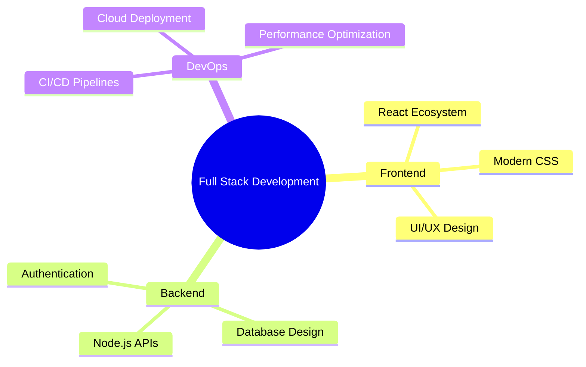

# 💫 Nazmul Hossain | Full Stack Developer

<div align="center">
  


[](https://github.com/armstain)
[](https://github.com/armstain)
[](https://github.com/armstain)

</div>

---

## 🚀 About Me

```javascript
const nazmul = {
    name: "Nazmul Hossain",
    role: "Full Stack Web Developer",
    location: "Bangladesh 🇧🇩",
    passion: "Building web solutions that make a difference",
    currentFocus: "Modern web technologies & scalable applications",
    funFact: "I debug with console.log() and I'm not ashamed! 😄"
};

console.log("Welcome to my GitHub profile!");
```

🎯 **What I Do:**
- 🔥 Build responsive and dynamic web applications
- 🎨 Create pixel-perfect UI/UX designs
- 🛠️ Develop scalable backend solutions
- 📱 Craft mobile-first responsive designs
- 🚀 Deploy and maintain production applications

---

## 🌐 Connect With Me

<div align="center">

[](https://discord.gg/https://discord.com/invite/6CHR25Jh)
[](https://www.linkedin.com/in/nazmul-hossain-adnan/)
[](https://x.com/armstain)
[](#)
[](mailto:your.email@example.com)

</div>

---

## 💻 Tech Arsenal

### 🎨 Frontend Technologies
<div align="center">


</div>

### ⚙️ Backend & Database
<div align="center">


</div>

### 🛠️ Tools & Libraries
<div align="center">


</div>

### 🎨 Design Tools
<div align="center">


</div>

### 🚀 Deployment & Hosting
<div align="center">


</div>

---

## 📊 GitHub Analytics

<div align="center">
  
### 🏆 GitHub Trophies
[](https://github.com/ryo-ma/github-profile-trophy)

### 📈 GitHub Stats


### 🔥 GitHub Streak


### 📊 Contribution Graph
[](https://github.com/ashutosh00710/github-readme-activity-graph)

</div>

---

## 🎯 Current Focus

<div align="center">



</div>

---

## 🎨 Coding Activity

<!--START_SECTION:waka-->
<!--END_SECTION:waka-->

---

## 💡 Random Dev Quote

<div align="center">


</div>

---

## 🐍 Contribution Snake

<div align="center">
  


</div>

---

<div align="center">

### 💬 Let's Build Something Amazing Together!


**"Code is like humor. When you have to explain it, it's bad." – Cory House**

⭐ **If you find my work interesting, consider giving it a star!** ⭐

</div>
